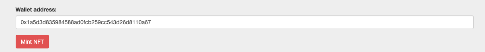

# NFT-Minter-and-Authenticator

## Background
Given the following scenario: An academic Institution is offering NFT certificates to their students upon completion of their program. A student was presented with an employment opportunity after graduation. However, the employer needs to validate the authenticity of the NFT certificate before issuing the offer to the student.

This project will develop a tool that allows academic institutions to Mint NFTs and employers to validate the authenticity of the minted NFTs. Offering an open source tool that simplifies and standardizes the authentication process without the use of Ether Scan and prevents possible fraud.

This tool can be modified to be used with other industries.

#### [Click here to view slide deck presentation](https://github.com/ChantalAG/NFT-Tokenizer-and-Authenticator/blob/main/NFT%20Minter%20%26%20Authenticator%20presentation_Aug13%2C2022.key)
### Minting

NFT Minter will establish a connection with the institution and issue a key for encryption that will be used during the minting process
During minting the key will be used to encrypt NFT attributes including “encrypted data” as an additional NFT attribute.

The NFT will be minted for each student at graduation and include the following attributes:

* Student Name: e.g., Marcus Policicchio
* Grade: e.g., A+
* Creation time (timestamp): e.g., 2022-13-08T11:11
* Description: e.g., Class of August 2022
* Institution’s Metamask public address: 0x755ABC
* Name of trusted party: NFT Minter & Authenticator
* Encrypted data attribute: e.g., b'gAAAAABi9c9Tiusj

The academic institution will go through a one time setup and registration of their metamask account.  
The app will get a token from a trusted entity where the metamask account will be registered. This trusted entity will provide a one time token for the account address and keep track of tokens issued (i.e it will keep a mapping of account adress, time of token issuance and actual token).

### Authentication

Employer will access the Authenticator’s UI on Flask and input NFT details and then authenticator will retrieve the encryption key to decrypt the encrypted NFT attributes.
Authenticator will compare the decrypted data with the unencrypted data of the NFT to confirm the data matches.  (NFT is authenticated!)

Potential scenario 1: 

Anyone could create a similar NFT by copying the  attributes of the original NFT and only change the account address and pretend to be the original creator of the NFT.
However, it will not have the token that was used to encrypt/decrypt the data. This token information will only be available with the trusted third party and the original creator of the NFT.
So in order to authenticate the NFT, the details of the NFT will be sent to the original creator of the NFT.
The third party can decrypt the data using the token it generated for the account address and time, in this case it will not have the new account address or it will be mapped to a different token and thus the decryption will not be successful and the fraud can be identified.

Potential scenario 2: 

A fraud user could specify the same creator_account_address but change some other attribute of the NFT like Name or description. In that case, the third party will be able to decrypt the data as it will be able to find the token for the account address. However, after decryption, it will find that the decrypted data has a different Name than the name of the replicated NFT and thus can identify that the NFT is not original.
The original attributes of the NFT will have to match the decrypted data in order to confirm that the NFT is original.

## Technologies
Metamask, 
Remix, 
Ganache, 
Python, 
Solidity, 
Flask, 
Html,
Java script

## Installation Guide
### Set up instructions
1) python3 -m venv env
2) source env/bin/activate
3) pip3 install flask
4) set FLASK_APP=app.py
5) flask run
6) Running on http://127.0.0.1:5000/ 
7) pip install cryptography

The following properties have to be defined in the .env file:

WEB3_PROVIDER_URI=HTTP://127.0.0.1:7545 (This app is currently developed/tested on Ganach local network)

SMART_CONTRACT_ADDRESS= "SMART CONTRACT ADDRESS"

PINATA_API_KEY= "API_KEY"

PINATA_SECRET_API_KEY= "SECRET API KEY"

## Usage and Examples
The certificate image path will be an attribute of the NFT that indicates the location in IPFS where the image was stored in blockchain.

The encrypted data indicated by the attribute encrypted_data when descrypted will result in the value of the attribute nft_data which will have all the details of the NFT.
  
**Example:** "nft_data":"{\"name\": \"student_name\", \"grade\": \"A+\", \"description\": \"Fintech course at University of Toronto\", \"wallet_address\": \"0x1a5d3d835984588ad0fcb259cc543d26d8110a67\", \"minter\": \"University of Toronto\"}

**Example of the NFT json data:**
{"nft_data":"{\"name\": \"student_name\", \"grade\": \"A+\", \"description\": \"Fintech course at University of Toronto\", \"wallet_address\": \"0x1a5d3d835984588ad0fcb259cc543d26d8110a67\", \"minter\": \"University of Toronto\"}","image":"ipfs.io/ipfs/Qmd8PSqng6QzreVArX5X5gr9KnC2diQkTRJPDaRfKW2LUU","encrypted_data":"b'gAAAAABi9c9TiusjBFtRuGoFfGu0LgmZcw9z_HlyziJ6ZvtsYg6v-Gju0DPlhC3jmyWNqJrSBOSTrUrhD5jR5j8b6rdSo0TDAFEB_zyA2qTPNiv-2q-pbj6PRLC62tAMtVPwyRJMTRfU3Wi7Y1FU6Wa3U4I_LZ1qEEqk1Rt3G_NzANJA89GVBcOqwWh-wJG5jkhG-bwZi0r7HEXlolCisXdVez6vZRKtNyxcUhO9M2RLRMRA3DmXNMXFlEL7KLy0B0ipWXTcxkm5chkSIqaVueKYzNuQDxMiCCwCWjMnoIxSLuRs9alEdXmlzxPmKdnDwW6WXsTewbz6p2RtT-nLSUDx8WXthwIZ2Q=='"}

### [Click here for video demo](https://github.com/ChantalAG/NFT-Tokenizer-and-Authenticator/blob/main/App-Presentation-Short-Demo.mov)

### Screenshots

## Connect to metamask wallet

## Verify metamask connected

## Account address populated

## Submit NFT data in form and click button to mint the NFT

## Page displayes result of minting

## Verify certificated uploaded on IPFS network

## Check attributes of the NFT including encrypted data

## Contributors
Chantal Garnett

Sameer Lakhe

Emiliano Mendez

Marcus Policicchio

